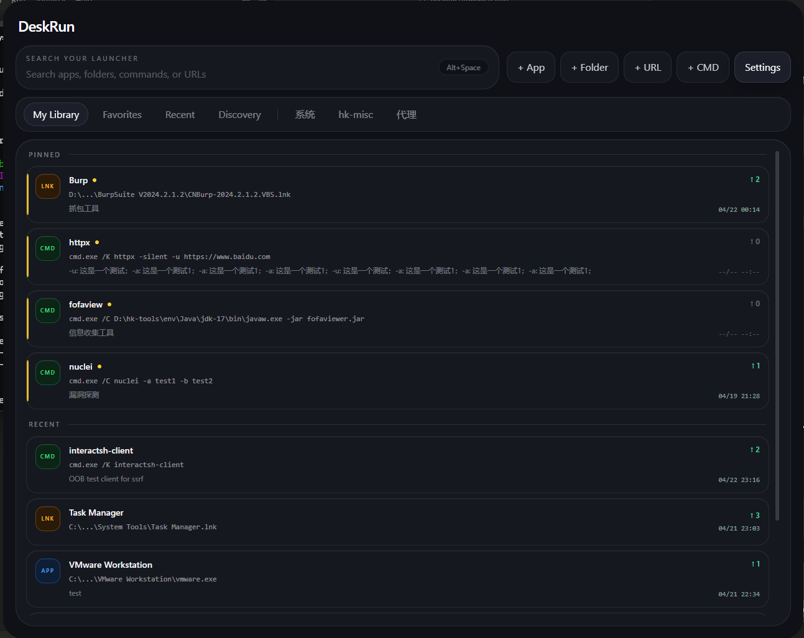
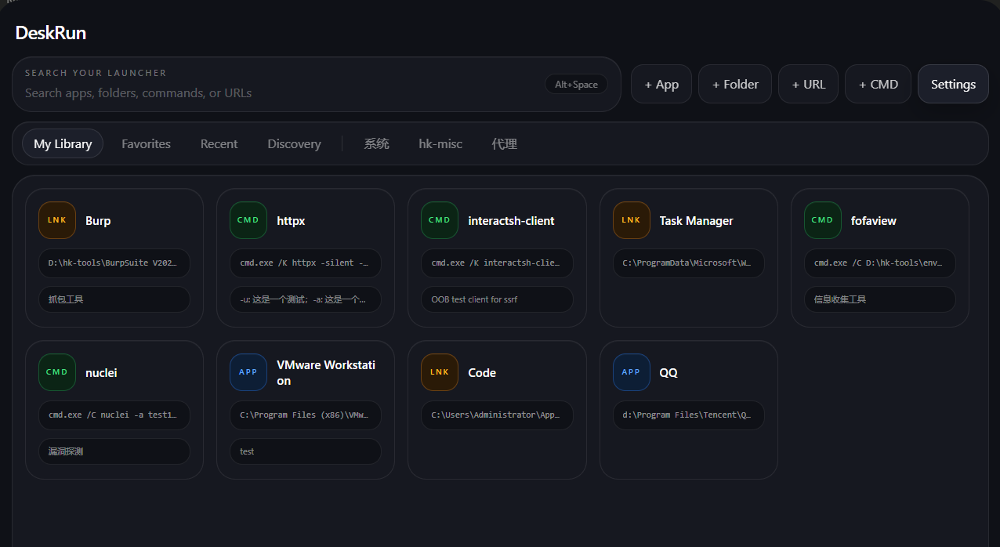
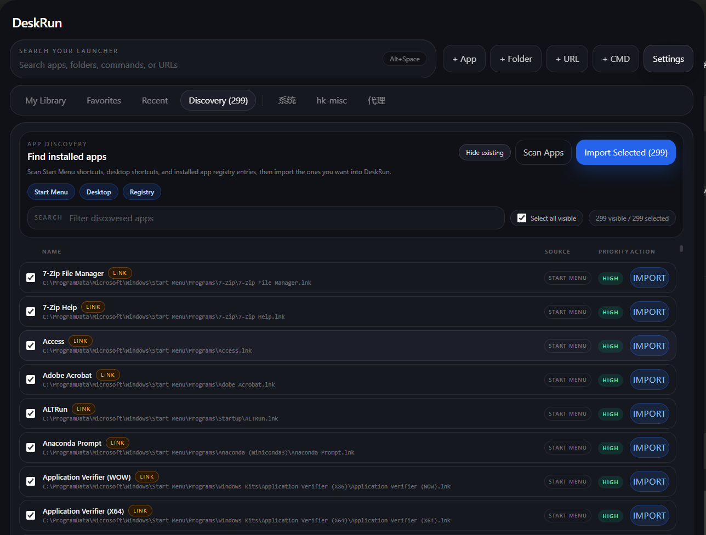

# DeskRun

Fast, polished, and ultra-lightweight Windows 11 launcher with typical idle memory usage around `9 MB`.

DeskRun is built with `Rust + Tauri 2 + SolidJS`.

It is designed around one fast path:

`Alt + Space` -> find something -> launch it

The current version focuses on a clean desktop experience, stable launching, and manual control over your launcher items.

## Screenshots

### List View



### Grid View



### Discovery View



## Features

- Global hotkey support, defaulting to `Alt+Space`
- Tray-based app lifecycle with background resident behavior
- Extremely lightweight, with typical idle memory usage around `9 MB` on Windows 11
- Add launcher items manually
- Support for `.exe`, `.lnk`, folders, URLs, and `cmd` commands
- Drag and drop import for files and folders
- Custom groups and drag-to-reorder
- JSON-based local persistence
- Windows icon extraction and icon caching
- Window size settings with saved size restore
- CMD items with:
  - fixed arguments
  - saved runtime arguments
  - full command preview
  - `Copy Command` from the context menu

## Current Scope

DeskRun v1 intentionally keeps the scope small and focused.

Included:

- Manual launcher item management
- Windows 11 desktop UI
- Single-window launcher workflow
- Local-only storage

Not included yet:

- Automatic app scanning
- Plugin system
- Cloud sync
- PowerShell command mode
- Cross-platform support

## Tech Stack

- `Rust`
- `Tauri 2`
- `SolidJS`
- `Vite`
- `Tailwind CSS`
- Windows API bindings via the `windows` crate

## Supported Platform

- Windows 11

This project currently targets Windows desktop only.

## Quick Start

### Prerequisites

- `Node.js`
- `npm`
- `Rust` toolchain
- Tauri build requirements for Windows
- `WebView2` available on the system

If your Rust and Node environments are already set up, install dependencies with:

```bash
npm install
```

### Run In Development

```bash
npm run tauri dev
```

### Build

```bash
npm run tauri build
```

The packaged Windows build will be generated under the Tauri bundle output directory inside `src-tauri/target/release/bundle`.

### Clean Build Outputs

```bash
npm run clean
```

## Usage

### Add Items

You can add:

- apps from `.exe` or `.lnk`
- folders
- URLs
- CMD commands

You can also drag files or folders into the launcher window.

### CMD Commands

DeskRun supports command items that run through `cmd.exe`.

Example:

- Command: `httpx`
- Fixed Args: `-silent -threads 50`
- Runtime Args: `-u https://example.com`

DeskRun stores the full command arguments ahead of time and launches them directly:

```cmd
cmd.exe /C httpx -silent -threads 50 -u https://example.com
```

If `Keep CMD window open` is enabled, DeskRun will use `/K` instead of `/C`.

## Data Storage

DeskRun stores data in the app data directory provided by the operating system.

Current persisted files:

- `settings.json`
- `items.json`
- `icons/`

Default Windows location:

```text
C:\Users\<your-user>\AppData\Roaming\com.deskrun.desktop\
```

### Custom Config Folder

DeskRun also supports a user-configurable config directory.

You can change it from:

`Settings -> Config folder`

Supported actions:

- choose a custom folder
- open the current config folder
- reset back to the default folder
- export the current config as a portable folder
- import a previously exported config folder

When you switch the config folder, DeskRun will migrate the current data to the new location, including:

- `settings.json`
- `items.json`
- `icons/`

The selected config folder is remembered and used again on the next app launch.

### Import / Export Config

DeskRun can export the current local configuration to a standalone folder that includes:

- `settings.json`
- `items.json`
- `icons/`

You can later import that folder back into DeskRun.

Importing a config folder replaces the current local launcher data in the active config directory.

## Project Structure

```text
src/         frontend UI and interaction logic
src-tauri/   Rust backend, launcher logic, tray, hotkey, storage
public/      static assets
```

## Development Notes

- The main launcher window starts hidden
- The app stays available through the tray
- Closing the window hides it instead of terminating the app
- Launch execution is handled on the Rust side
- Local state is persisted as JSON for simplicity in v1

## Roadmap

Potential next steps:

- Better search and matching
- Better command presets and parameter workflows
- Import/export
- Better icon customization
- App discovery
- Plugin architecture

## Contributing

Issues and pull requests are welcome.

If you plan to contribute, keeping the project focused on the core launcher experience will help a lot.
