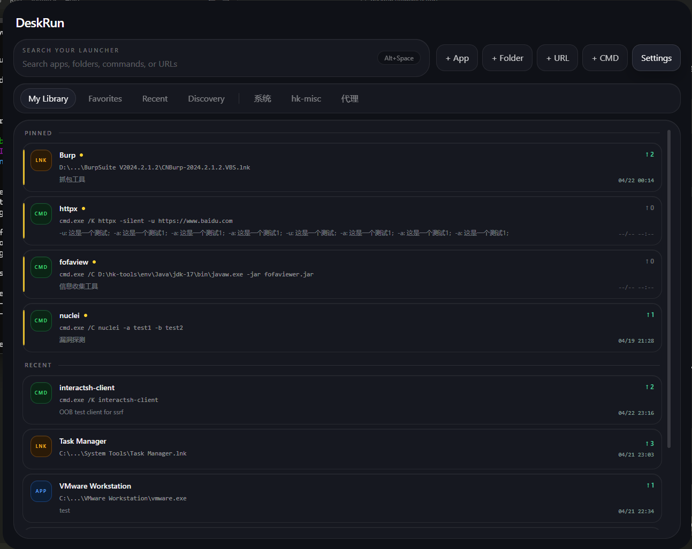
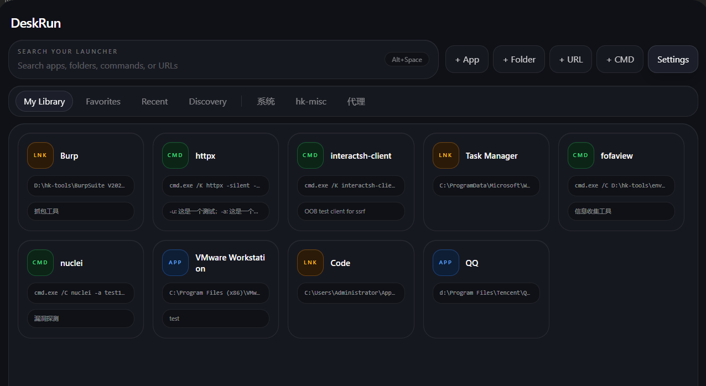
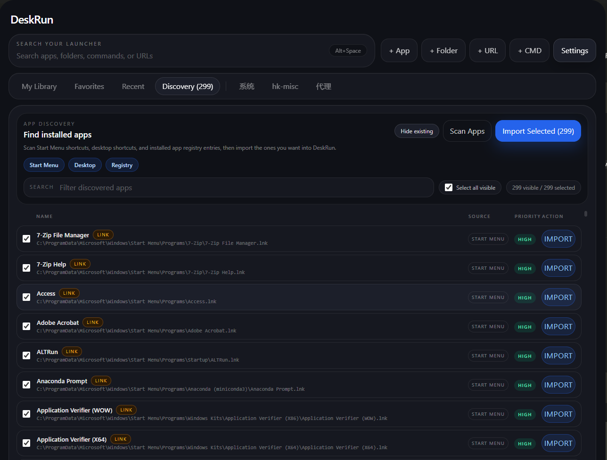

# DeskRun

快速、精致的 Windows 11 启动器。

关于内存占用，说清楚一点：真正属于 DeskRun 的 Rust 宿主进程闲置时占用约 `9 MB` 私有工作集，
但界面由 WebView2 渲染，跑在几个独立的子进程里。**整个应用闲置时的实际占用约为 `205 MB`
私有工作集 / `440 MB` 工作集**，其中绝大部分是 WebView2 运行时——这是所有基于 WebView2 的
桌面应用的共同成本，不是 DeskRun 独有的。如果你在别处看到「9 MB」这个数字（包括本项目早期
的文档），那是只统计了宿主进程。

技术栈：`Rust + Tauri 2 + SolidJS`。

整个产品围绕一条最短路径设计：

`Alt + Space` → 找到目标 → 启动

当前版本聚焦于干净的桌面体验、稳定的启动流程，以及对手动添加的启动项的完全掌控。

## 截图

### 列表视图



### 网格视图



### 发现视图



## 功能

- 全局热键，默认 `Alt+Space`
- 托盘驻留的应用生命周期，后台常驻
- 很轻：宿主进程闲置约 `9 MB` 私有工作集，整个应用的占用见文首说明
- 手动添加启动项
- 支持 `.exe`、`.lnk`、文件夹、URL 和 `cmd` 命令
- 以管理员身份运行（条目级开关，或右键一次性提权）
- 复制条目，快速做出参数不同的变体
- 搜不到时给出兜底动作：打开 URL、网页搜索、进制转换
- 拖拽导入文件和文件夹
- 自定义分组，分组可嵌套、可拖拽排序，左侧分组栏（`Ctrl+B` 或标题栏右侧按钮可收起）
- 基于 JSON 的本地持久化
- Windows 图标提取与图标缓存
- 窗口尺寸设置，并记住上次的尺寸
- 界面缩放：`90%` / `100%` / `115%` / `130%`，文字、图标和间距一起变
- CMD 启动项支持：
  - 固定参数
  - 保存的运行时参数
  - 完整的命令预览
  - 右键菜单中的 `Copy Command`

## 当前范围

DeskRun v1 有意保持小而专注。

已包含：

- 手动的启动项管理
- Windows 11 桌面 UI
- 单窗口的启动器工作流
- 纯本地存储

暂不包含：

- 自动或定时扫描应用（Discovery 只在手动点击时运行）
- 插件系统
- 云同步
- PowerShell 命令模式
- 跨平台支持

## 技术栈

- `Rust`
- `Tauri 2`
- `SolidJS`
- `Vite`
- `Tailwind CSS`
- 通过 `windows` crate 调用 Windows API

## 支持平台

- Windows 11

本项目目前仅面向 Windows 桌面。

## 快速开始

### 环境要求

一套全新的 Windows 系统里，DeskRun 需要的东西一样都没有。一共有四项要装，且**必须按这个顺序**——Rust 安装器会检查 MSVC 链接器，如果生成工具还没装就会给出警告。

| 依赖 | 用途 | 下载体积 |
| --- | --- | --- |
| Node.js 20+ | 构建前端 | 约 30 MB |
| Visual Studio Build Tools 2022 | Windows 上 Rust 通过 MSVC 链接 | 2–5 GB |
| Rust（MSVC 工具链） | 编译后端 | 约 1 GB |
| WebView2 Runtime | 渲染界面 | 约 150 MB |

#### 1. Node.js

从 [nodejs.org](https://nodejs.org) 安装 LTS 版本，然后在新终端里验证：

```bash
node -v
npm -v
```

#### 2. Visual Studio Build Tools 2022

不需要装完整的 Visual Studio，独立的 Build Tools 就够了。下载 `vs_BuildTools.exe`（<https://aka.ms/vs/17/release/vs_BuildTools.exe>）并运行：

```powershell
vs_BuildTools.exe --quiet --wait --norestart --nocache `
  --add Microsoft.VisualStudio.Workload.VCTools `
  --includeRecommended
```

`--includeRecommended` 是它把 Windows SDK 一起拉下来的关键，MSVC 编译器和 Windows SDK 两者缺一不可。这一步是几 GB 的下载，会花不少时间。退出码 `3010` 表示安装成功但需要重启系统。

确认 C++ 工具集已就位：

```powershell
& "${env:ProgramFiles(x86)}\Microsoft Visual Studio\Installer\vswhere.exe" `
  -products * -requires Microsoft.VisualStudio.Component.VC.Tools.x86.x64 -property installationPath
```

它应该输出一个安装路径。如果什么都没输出，说明工作负载没装上。

#### 3. Rust

下载 `rustup-init.exe`（<https://static.rust-lang.org/rustup/dist/x86_64-pc-windows-msvc/rustup-init.exe>）并运行：

```powershell
.\rustup-init.exe -y --default-toolchain stable --profile default --default-host x86_64-pc-windows-msvc
```

然后**重新开一个终端**，让 `PATH` 读取到 `%USERPROFILE%\.cargo\bin`，再验证：

```bash
rustc --version
cargo --version
```

#### 4. WebView2 Runtime

Windows 11 通常自带 WebView2，但精简版系统——尤其是 IoT Enterprise LTSC——不带。先检查：

```powershell
reg query "HKLM\SOFTWARE\WOW6432Node\Microsoft\EdgeUpdate\Clients\{F3017226-FE2A-4295-8BDF-00C3A9A7E4C5}" /v pv
```

如果没有输出，下载 Evergreen 引导程序（<https://go.microsoft.com/fwlink/p/?LinkId=2124703>）并运行：

```powershell
.\MicrosoftEdgeWebview2Setup.exe /silent /install
```

也可以直接查看 `C:\Program Files (x86)\Microsoft\EdgeWebView\Application\` 下是否存在带版本号的文件夹来确认。

### 验证工具链

在等待完整的 Tauri 构建之前，先编译一个单文件程序是验证链接器是否可用的最快方式：

```bash
echo 'fn main() { println!("linker ok"); }' > hello.rs
rustc hello.rs -o hello.exe
./hello.exe
```

然后再真正构建整个应用：

```bash
npm install
npm run tauri build
```

### 开发模式

```bash
npm run tauri dev
```

### 仅前端，在浏览器里运行

不编译任何 Rust 也能调试样式和布局：

```bash
npm run dev
```

这条命令只启动 Vite。`src/tauri-shim.ts` 会顶替 Tauri 的 IPC 桥，`src/dev-fixture.ts` 提供示例启动项、分组和发现候选，所以网格、列表、发现、编辑器和设置这些界面都能正常渲染。窗口相关的行为（拖动、缩放、托盘、实际启动、失焦隐藏）在这里是失效的，必须用 `npm run tauri dev` 验证。

### 构建

```bash
npm run tauri build
```

打包好的 Windows 产物输出到 `src-tauri/target/release/bundle`——`msi/` 下是 `.msi`，`nsis/` 下是 NSIS 安装器。免安装的可执行文件在 `src-tauri/target/release/deskrun.exe`。

### 代码检查

```bash
npm run typecheck
```

```bash
npm run test
```

```bash
npm run lint:rust
```

`npm run build` 本身只跑 Vite，**不做类型检查**——上面第一条才是。`npm run test` 会先做类型检查再跑
Rust 单元测试，`npm run lint:rust` 用 clippy 并把警告视为错误。三项都已在 CI 里把关（见
`.github/workflows/ci.yml`），此外 CI 还会检查版本号在 `Cargo.toml`、`tauri.conf.json`、
`package.json` 三处是否一致。

### 清理构建产物

```bash
npm run clean
```

### 常见问题

**刚装完 Rust 就报 `failed to run 'cargo metadata' ... program not found`。** `rustup` 会把 `%USERPROFILE%\.cargo\bin` 追加到用户 `PATH`，但已经在运行的进程持有的是旧环境。如果终端是嵌在编辑器或 IDE 里的，新开一个*标签页*没用——必须重启宿主应用本身才能重新读取环境变量。

不想重启的话，在当前会话里手动前置路径：

```powershell
$env:Path = "$env:USERPROFILE\.cargo\bin;$env:Path"
```

```bash
export PATH="$HOME/.cargo/bin:$PATH"
```

确认路径已经持久化（应该能看到 `C:\Users\<你的用户名>\.cargo\bin`）：

```powershell
[Environment]::GetEnvironmentVariable('Path','User')
```

**下载安装器时报 `curl: (56) Recv failure: Connection was reset`。** 传输中途连接被重置。用断点续传重试，而不是从头再来：

```bash
curl -sSL --retry 12 --retry-all-errors --retry-delay 3 -C - -o rustup-init.exe <url>
```

**在 Git Bash 里运行 WebView2 安装器，退出码 87（参数无效）。** Git Bash 会在程序看到参数之前把 `/silent` 改写成 Windows 路径。关掉这个转换即可：

```bash
MSYS_NO_PATHCONV=1 ./MicrosoftEdgeWebview2Setup.exe /silent /install
```

## 使用

### 键盘

整个启动器可以不碰鼠标用完：

| 按键 | 作用 |
| --- | --- |
| `Alt+Space` | 呼出 / 收起窗口（可在 设置 → Global hotkey 里改） |
| 直接打字 | 搜索**所有分组**里的条目（支持拼音全拼与首字母）；收藏与最近用过的排在前面，同一个条目只出现一次 |
| `↑` `↓` | 在**当前所在的面板**里移动：分组栏里是切换视图，结果区里是移动选中项（网格模式下按整行跳） |
| `←` `→` | 在两个面板之间移动。在网格里它们先沿着一行走，走到行的两端才切面板；在列表里每一行都是整宽，所以直接切面板 |
| `Enter` | 启动选中项；没有匹配时执行列表里的第一条兜底动作。光标在分组栏时，`Enter` 表示"进入这一组" |
| `Shift+F10` 或菜单键 | 打开选中条目的操作菜单 |
| 菜单打开时 `↑` `↓` + `Enter` | 选择并执行菜单里的动作 |
| `Ctrl+B` | 收起 / 展开左侧分组栏 |
| `Ctrl+,` | 打开设置 |
| `Esc` | 逐层关闭：菜单 → 对话框 → 设置；都没有时收起窗口 |

两个面板共用一组方向键，而光标始终留在搜索框里——打字永远是搜索。所以输入过程中 `←` `→` 先归光标，把查询文字走到两端之后才去切面板；搜索框是单行的，`↑` `↓` 没有光标可移，直接归面板。

条目启动失败、而它的目标已经不在了（程序被卸载、文件被删）时，会直接问你**是否删除**这个条目——这是唯一一种"用户能处理的"启动失败，其余仍然只报错。窗口收起时搜索框会被清空，下次呼出是干净的。

搜索命中的部分会被标出来，所以能一眼看出"为什么这条会被匹配到"。

### 添加启动项

可以添加：

- 来自 `.exe` 或 `.lnk` 的应用
- 文件夹
- URL
- CMD 命令

也可以直接把文件或文件夹拖进启动器窗口。

### CMD 命令

DeskRun 支持通过 `cmd.exe` 执行的命令型启动项。

示例：

- Command：`httpx`
- Fixed Args：`-silent -threads 50`
- Runtime Args：`-u https://example.com`

DeskRun 会把完整的命令参数预先存好，启动时直接执行：

```cmd
cmd.exe /C httpx -silent -threads 50 -u https://example.com
```

如果启用了 `Keep CMD window open`，DeskRun 会改用 `/K` 而不是 `/C`。

### 搜不到时的兜底

当查询没有匹配任何启动项时，列表里不会只显示一句"没有结果"，而是给出可以立刻执行的选项，回车运行第一条：

| 你输入 | 会得到 |
| --- | --- |
| `example.com`、`localhost:8080` | 在浏览器中打开（自动补上 `https://` / `http://`） |
| `0x1f`、`1fh`、`0b1010`、`0o17`、`255` | 进制转换，回车复制另一种表示 |
| 其它任意内容 | 用默认浏览器搜索 |

裸数字按十进制处理，只有 `0x` / `h` 后缀才当作十六进制——`1b` 这种既像二进制的后缀、又像没加前缀的十六进制，一律不猜，直接当作普通搜索词。

### 以管理员身份运行

有两种方式：

- 条目级：在编辑对话框里勾选 `Run as administrator`，之后每次启动都会弹 UAC
- 一次性：右键条目选 `Run as administrator`

URL 类型的条目不提供提权——给浏览器提权没有意义。UAC 被拒绝时会明确提示，而不是假装启动成功。

### 分组

分组在左侧的竖排栏里：上面是四个内置视图（All Items / Favorites / Recent / Discovery，各自带条目数），下面是你的分组，每个分组也显示它有多少条目。分组多了这一栏自己滚动，内置视图和底部的「+ New group」始终留在原位。

**分组可以套分组**，想套多深套多深：

- 子分组在父分组下面缩进显示；父分组前面有箭头，可以折叠起来
- **选中父分组 = 看到它下面所有层级的条目**，条目数也是这么算的（和文件夹一样）
- 新建子分组：把鼠标移到那一行，点行尾出现的 `+`
- 移动分组：上下拖动。落在行的中间 = 放进这个分组里，落在线条上 = 排在它前/后
- 删除父分组：它自己的条目回到 Ungrouped，**里面的子分组上移一级**（不会被一起删掉）

**分组上的操作都在分组栏里**：把鼠标移到某一行，行尾会出现 `+`（在这个分组里新建）；在任意分组上点右键，菜单里有

- **New group inside** ——在这个分组里新建
- **Rename** ——就地改名，回车确认、Esc 取消
- **Move to top level** ——把嵌套的分组移回顶层（只有嵌套的分组才有这一项）
- **Delete** ——删除前会说明后果：它自己的条目回到 Ungrouped、**里面的子分组上移一级**（不会跟着一起删）

其余入口：

- **`+ New group`**（栏底）——新建顶层分组。点一下变成输入框，回车创建，Esc 取消；名字重复会保留输入并提示
- **上下拖动分组** ——调整顺序；落在行的中间 = 放进这个分组里，落在线上 = 排在它前/后
- **`Ctrl+B` 或标题行右侧的按钮** ——收起 / 展开整栏，收起后省下的宽度还给条目列表；这个状态会记住
- **设置** 里不再有 Groups 一栏，分组的增删改都收在分组栏上

分组名必须唯一。侧边栏里两个同名分组没法区分，条目编辑器里的分组下拉也选不准，所以这条规则保留。

## 数据存储

DeskRun 把数据存放在操作系统提供的应用数据目录中。

当前持久化的文件：

- `settings.json`
- `items.json`
- `icons/`

Windows 上的默认位置：

```text
C:\Users\<你的用户名>\AppData\Roaming\com.deskrun.desktop\
```

### 自定义配置目录

DeskRun 也支持用户自行指定配置目录。

入口在：

`Settings -> Config folder`

支持的操作：

- 选择自定义文件夹
- 打开当前配置文件夹
- 重置回默认文件夹
- 把当前配置导出为可移植的文件夹
- 导入之前导出的配置文件夹

切换配置文件夹时，DeskRun 会把当前数据迁移到新位置，包括：

- `settings.json`
- `items.json`
- `icons/`

选定的配置目录会被记住，并在下次启动时继续使用。

### 导入 / 导出配置

DeskRun 可以把当前的本地配置导出成一个独立文件夹，其中包含：

- `settings.json`
- `items.json`
- `icons/`

之后可以再把这个文件夹导入回 DeskRun。

导入配置文件夹会替换当前配置目录下的启动器数据。

## 项目结构

```text
src/         前端 UI 与交互逻辑
src-tauri/   Rust 后端、启动逻辑、托盘、热键、存储
public/      静态资源
```

## 开发说明

- 主启动器窗口启动时是隐藏的
- 应用通过托盘保持可用
- 关闭窗口只是隐藏，不会终止进程
- 实际启动在 Rust 侧执行
- v1 出于简单考虑，本地状态以 JSON 持久化

## 路线图

可能的下一步：

- 更好的搜索与匹配
- 更好的命令预设与参数工作流（启动时再传参数，而不是把参数存进条目）
- 更好的图标自定义
- 插件架构

## 贡献

欢迎提交 issue 和 pull request。

如果你打算参与贡献，保持项目聚焦在启动器核心体验上会有很大帮助。
